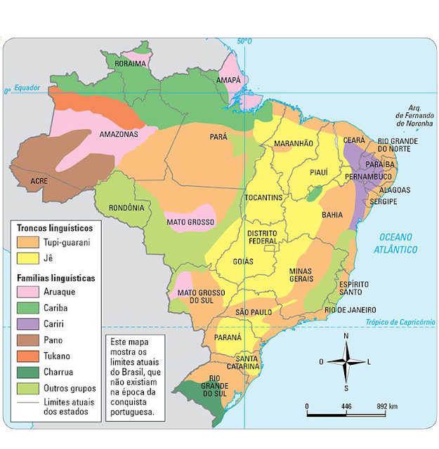
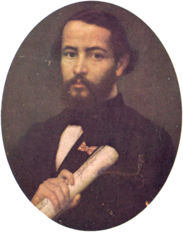
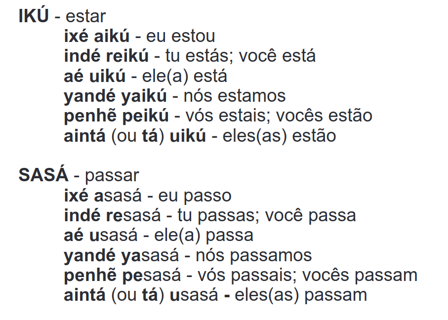
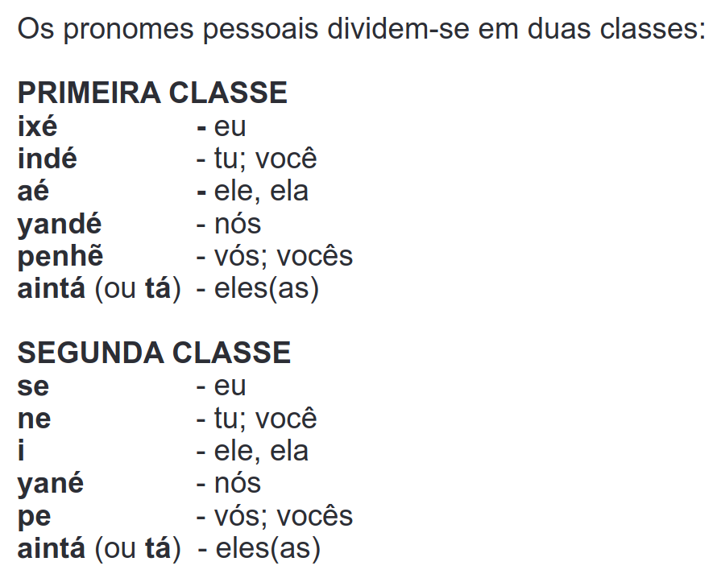
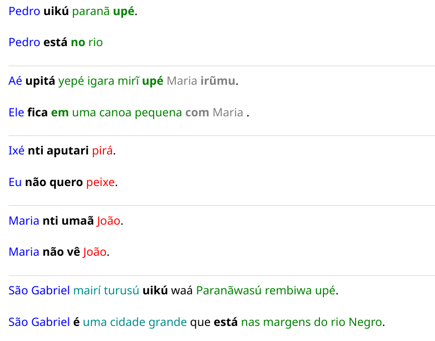
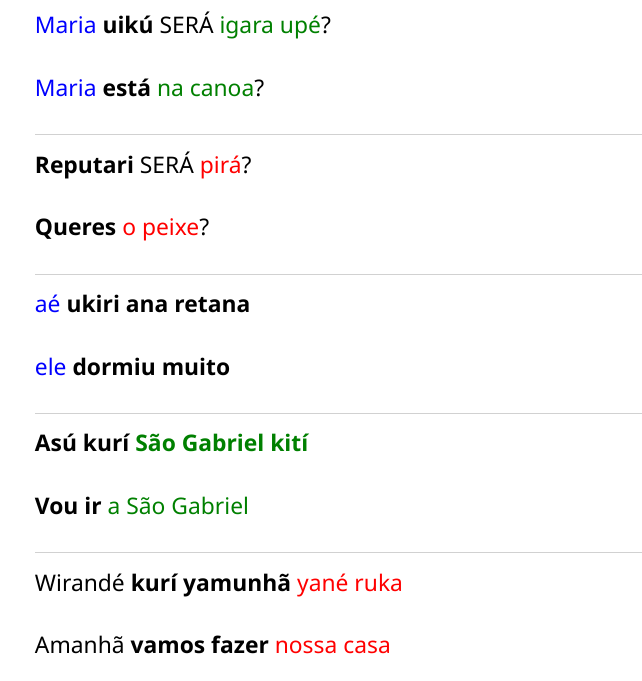

# Lingua Geral, Nheengatu ou Tupi Moderno

Trabalho sobre a Língua Geral do Brasil elaborado e apresentado para a disciplina de interlinguistica. Este trabalho tenta abordar os seguintes tópicos:

- aspectos históricos;
- aspectos sociais: número de falantes; aceitação da língua na comunidade; falantes nativos;
- aspectos políticos e educacionais: há/houve apoio estatal?; a língua está/estava inserida no sistema educacional?
- a língua na literatura e nos meios de comunicação;
- aspectos geográficos: em que região/regiões é/foi falada a língua;

## 1. Aspectos Históricos

Diferentemente de outras línguas que se poderiam classificar como línguas étnicas, por serem usadas somente por populações indígenas, a Língua Geral foi ali mais falada que o próprio Português, inclusive por não índios, até o ano de 1877, quando começava o Ciclo da Borracha [[1]].

Essa língua supraétnica nasceu do Tupi Antigo, usado na maior parte da costa brasileira no tempo da chegada dos portugueses, em 1500. Os indígenas da costa que falavam variantes dialetais dele eram chamados genericamente de tupis [[1]].

Podemos dizer que o Tupi foi falado até o final do século XVII, após o que se foi transformando na Língua Geral, em seus dois principais ramos, a Amazônica e a Meridional. A Língua Geral Amazônica transformou-se, no século XIX, no Nheengatu [[1]]. 

### 1.1. Primeira Fase da Língua Geral

A Língua Geral foi considerada sucessivamente como "língua de branco", na colônia, "língua brasileira",no Império, e "língua de índio", nas últimas décadas no Rio Negro [[2]].

O colonizador se apropria de um traço cultural do "outro" e o transforma num elemento-c have da ação colonizatória, itnpondo sua própria religião e seu modo de vida às diversas etnias nativas [[2]].

A institucionalização de uma língua indígena como língua de contato não foi uma peculiaridade da colonização da Amazônia. Ela foi um estilo de política das missões religiosas tanto nas colônias espanholas como nas portuguesas, com o beneplácito da administração colonial [[2]].

A Companhia de Jesus é um caso exemplar de aplicação desta politica lingüística colonial em
todos os lugares que atuaram entre os séculos XVI-XVII. Seu regimento interno (Ratio Studiorum) considerava como dever dos missionários aprender a língua dos povos a catequizar (Madureira, 1927) [[2]].

A primeira gramática da Língua Geral no Brasil foi publicada em 1594, feita por José de Anchieta, jesuíta da região de São Vicente. A segunda é a de Luís Figueiras, publicada em 1621,e reeditada em 1687 [[2]]. Na primeira situação, a Língua Geral é uma língua "construída" pelos brancos, a partir do 
tupinambá [[2]].

### 1.2. Segunda Fase da Língua Geral

Na segunda situação, a Língua Geral é retomada pelos intelectuais brasileiros corno um traço cultural típico e demarcador, no campo simbólico e ideológico, da originalidade cultural brasileira, objetivando estabelecer as diferenças entre a história brasileira e a européia [[2]].

Gonçalves Dias levou o tema do indigenismo tanto para a literatura como para os estudos históricos e etnográficos [[2]].

### 1.3. Terceira Fase da Língua Geral

O povo baré, do Rio Negro, hoje, adota a Língua Geral, outrora do "outro" branco colonizador, como sua própria [[2]].

### 1.4. Razões para o declínio da Língua

Três fatores principais concorreram para isso. Foram eles os seguintes:
- 1. As perseguições oficiais em meados do século XVIII

Era o século do Iluminismo. O projeto do governo português era ampliar
o uso da língua portuguesa, fortalecer o Estado, inserir os índios na sociedade
colonial e enfraquecer a Igreja, especialmente a sua principal ordem religiosa,
a Companhia de Jesus [[1]].  

- 2. A morte de milhares de falantes de Nheengatu durante a Cabanagem

- 3. As migrações de nordestinos para a amazônia durante o Ciclo da Borracha

Na colonização da América do Sul pelos portugueses e pelos espanhóis houve pelo menos três situações em que a miscigenação em grande escala de homens europeus com mulheres indígenas teve como conseqüência a rápida formação de populações mestiças cuja lingua materna foi a língua indígena das mães e não a língua europeia dos pais [[3]]. 

## 2. Aspectos Linguísticos

## 2.1. Principais Caracteristicas

- Sujeito verbo objeto
- Usa posposição ao invés de preposições
- Particula interrogação binária
- Sem gênero, morfema de plural opcional
- Sem artigos definido, com artigo indefinido (YEPÉ)
- Não tem o verbo ser, mas tem o verbo estar
- Repetição do verbo para dar ideia de repetição da ação
- Itá é um sufixo de marcação de plural, usado somente no substantivo. Se existe numeral, não precisa da marcação do plural.
- Não existem infinitivos verbais

## 2.2. Conjugação de Verbos

[Curso de Língua Geral [4]]

## 2.3. Pronomes Pessoais

## 2.2. Alguns Exemplos

Legenda de Cores:
- <nom>Nominativo</nom>
- <nomadj>Adjetivo do Nominativo</nomadj>
- <acu>Acusativo</acu>
- <vrb>Verbo Conjugado</vrb>
- <local> Localidade </local>
- <adicao> Adicao </adicao>

### 2.2.1. Substantivos e Adjetivos

- <nom>Pedro</nom> <nomadj>pisasú</nomadj>. - <nom>Pedro</nom> <vrb>é</vrb> <nomadj>novo</nomadj>
- <nom>Maria</nom> <nomadj>puranga</nomadj>. - <nom>Maria</nom> <vrb>é</vrb> <nomadj>bonita</nomadj>

- <nom>Ara</nom> <nomadj>puranga</nomadj> - <nom>Dia</nom> <nomadj>bonito</nomadj>
- <nomadj>puranga</nomadj> <nom>Ara</nom>! - <nomadj>bonito</nomadj> <nom>Dia</nom>

- <nom>gara</nom>    <nomadj>i pusé</nomadj>.    - <nom>A canoa</nom>  <vrb>é</vrb> <nomadj> (ela) pesada.</nomadj>
- <nom>Kurumĩ</nom>  <nomadj>i kiá</nomadj>.     - <nom>O menino</nom>  <vrb>é</vrb> <nomadj> (ele) sujo</nomadj>.
- <nom>Indé</nom>    <nomadj>ne kiá</nomadj>.    - <nom>Tu</nom>  <vrb>es</vrb> <nomadj> (tu) sujo</nomadj>.
- <nom>Yandé</nom>   <nomadj>yané pusé</nomadj>. - <nom>Nós</nom> <vrb>somos</vrb> <nomadj>(nós) pesados</nomadj>.

### 2.2.2. Relação Genetiva

- Joana mena. - marido de Joana
- Pedro igara. - canoa de Pedro
- paranã ií. - água do rio
- Maria mimbira. - filho de Maria: 

### 2.2.3. Frases mais longas

---

---

<nom>Pedro</nom> <vrb>uikú</vrb> <local>paranã <op>upé</op></local>.

<nom>Pedro</nom> <vrb>está</vrb> <local><op>no</op> rio</local>

---

<nom>Aé</nom> <vrb>upitá</vrb> <local>yepé igara mirĩ <op>upé</op></local> <adicao>Maria <op>irũmu</op></adicao>. 

<nom>Ele</nom> <vrb>fica</vrb> <local><op>em</op> uma canoa pequena</local> <adicao> <op>com</op> Maria </adicao>.

---

<nom>Ixé</nom> <vrb>nti aputari</vrb> <acu>pirá</acu>.

<nom>Eu</nom> <vrb>não quero</vrb> <acu>peixe</acu>.

---

<nom>Maria</nom> <vrb>nti umaã</vrb> <acu>João</acu>.

<nom>Maria</nom> <vrb>não vê</vrb> <acu>João</acu>.

---

<nom>São Gabriel</nom> <nomadj>mairí turusú</nomadj> <vrb>uikú</vrb> waá <local>Paranãwasú rembiwa upé</local>.

<nom>São Gabriel</nom> <vrb>é</vrb> <nomadj>uma cidade grande</nomadj> que <vrb>está</vrb> <local>nas margens do rio Negro</local>.

---

<nom>Maria</nom> <vrb>uikú</vrb> SERÁ <local>igara upé</local>?

<nom>Maria</nom> <vrb>está</vrb> <local>na canoa</local>?

---

<vrb>Reputari</vrb> SERÁ <acu>pirá</acu>?

<vrb>Queres</vrb> <acu>o peixe</acu>?

---

<nom>aé</nom> <vrb>ukiri ana retana</vrb>

<nom>ele</nom> <vrb>dormiu muito</vrb>

---

<vrb>Asú kurí<vrb> <local>São Gabriel kití</local>

<vrb>Vou ir</vrb> <local>a São Gabriel</local>

---

Wirandé <vrb>kurí yamunhã</vrb> <acu>yané ruka</acu>

Amanhã <vrb>vamos fazer</vrb> <acu>nossa casa</acu>

---

<nom>Maria</nom> <vrb>uyupirú umunhã</vrb> <acu>timbiú</acu> <dat>i anama-itá supé</dat>.

<nom>Maria</nom> <vrb>começa a fazer</vrb> <acu>comida</acu> <dat>para seus familiares</dat>.

---

### Prefixo mu sobre verbos -> causativo 

semu. - sair
musemu. - fazer sair

sufixo ima, less do ingles
sufixo sawa para adjetivos, converte adjetivo para substantivo
sufuxi sara para verbos, converte para fazedor

## 3. Referências

- [[1]]: O último refúgio da língua geral no Brasil
- [[2]]: A Língua Geral como Identidade Construída
- [[3]]: O conceito de “Língua Geral” à luz dos dicionários de língua geral existentes
- [[4]]: Livro do Curso de Língua Geral
- [[5]]: Nheengatu: o tupi moderno
- [[6]]: NHEENGATU, o Tupi Moderno - Língua Indígena Brasileira (Linguística)

[1]: https://www.scielo.br/j/ea/a/jpgHfzMs3Nhksmy8ftsy9qm/?format=pdf&lang=pt
[2]: https://www.revistas.usp.br/ra/article/download/111629/109666
[3]: http://www.scielo.br/pdf/delta/v30nspe/0102-4450-delta-30-spe-0591.pdf
[4]: https://mega.nz/file/A4xllaIa#m2sh3zN4WzgCIOdF7HwfA-FdXswG7v-lycZfeEKNX_o
[5]: https://www.youtube.com/watch?v=L73GUWZS8NM
[6]: https://www.youtube.com/watch?v=mz1QQSCzRUw